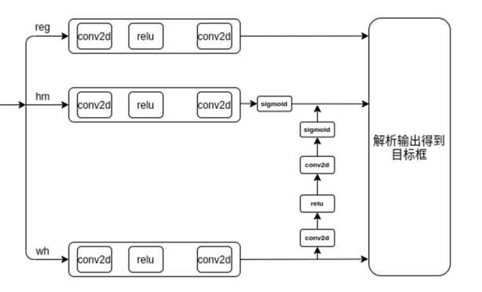

### 1.Heatmap
在CenterNet中讨论比较多的一点的就是热度图中的等半径高斯热度图，其中半径的原始计算方式见gaussain_radius函数，它来自CornerNet，但少除了个分母。因此在CenterNet的repo issue里面，很多人提出了如半径随目标形状等比例变化的高斯图方案。  
但考虑热度图的本身意义在于训练时衰减作为负例的非目标中心点所提供的损失值，这一点类似与FCOS的小数正例标签。但热度图并不会改变只有一个正例的事实，热度图训练的收敛极限一定是一个又一个的目标中心点图。
但什么样的热度图更符合CenterNet的实际情况, 对中心点周围每个点可能生成的最高IOU的最佳预测框  
  
拟合结果如下：  
  
可以明确的一点就是到中心点相同距离的点他们能产生预测框的最大IOU并不同，在中轴线上的似乎应该大一些。但这曲面并不好写表达式，而且IOU太小(<0.5)的点也并非我们感兴趣的。所以使用如下左边的图代替原始的热度图（右）：  
  
具体生成方式见`drawm`函数

### 2.重复预测问题
CenterNet基于关键点方式训练热度图，在实际中检测大目标常遇到重复检测的问题，根本上在于热度图收敛不够好。所以考虑采用多次重复使用最大值滤波的方式检测目标极点，但对多次的结果取平均值，本质上类似Softmax。 实际用后发现在收敛良好的热度图收敛较好时意义不大，但对小模型这种收敛能力较差的情况下，改善较大。 操作都直接在GPU完成，实际也没多少计算负担。

### 3.概率预测
概率预测最早由[generalized focal loss](github.com/implus/GFocal)提出。 于是考虑在CenterNet里面也加入试试， 实际使用发现里面的quality focal loss加入后训练更慢了，效果也并不好，但distribution focal loss把单一的预测转化成概率向量的预测，同时在输出头增加融合的分支，有一定效果。  

### 4.数据增强方式
增强方式的消融实验发现几何增强一般都能有效，而像素增强似乎效果不太好，见`config/*.yml`的pipeline,在crowdhuman的测试如下：  
